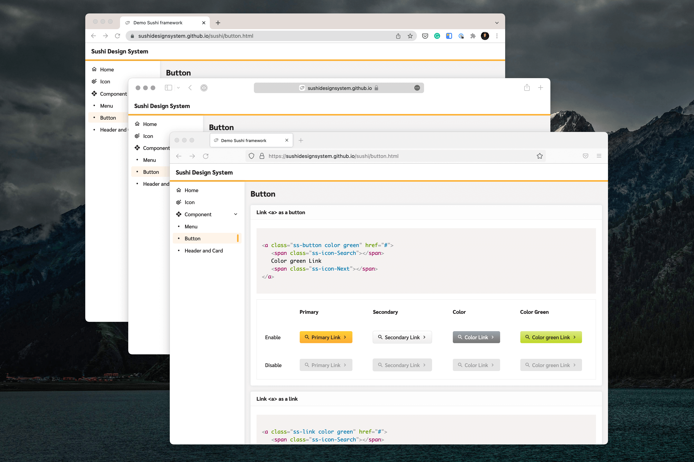
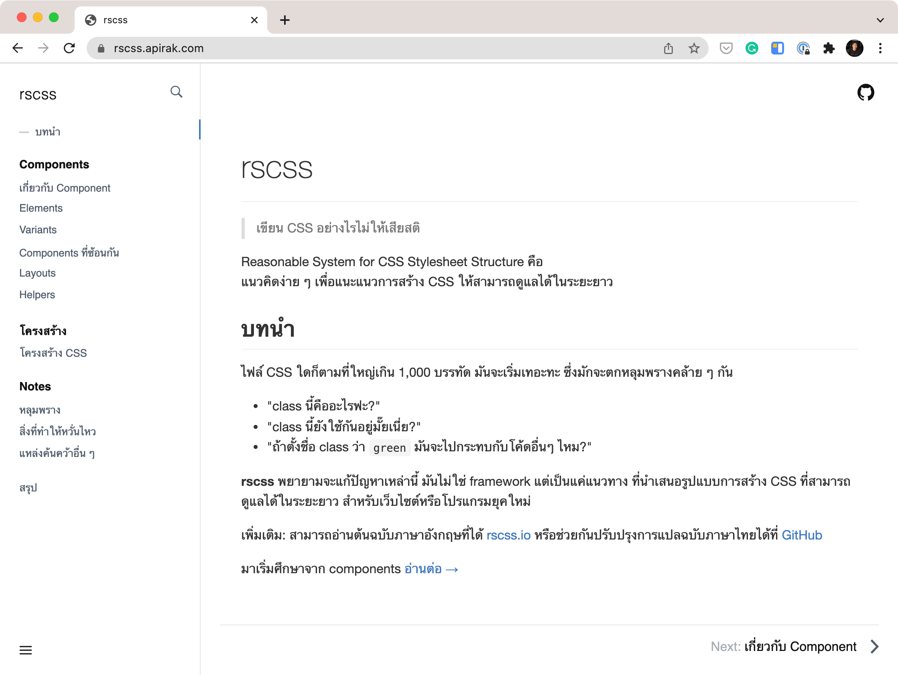

# Sushi
Sushi Design System helps us work together to build great experience for all of SET co-workers and listed companies.

We prepare HTML/CSS component as building blocks when you develop new products and features. We also prepare Figma's components for designers who prepare prototypes before development.



See the actual result here: https://sushidesignsystem.github.io/sushi

See Figma file here: [SET Main web](https://www.figma.com/file/YMSF7WZuIfrg33Rk9v1kYg/%E2%9D%96-SET-MAIN-%2F-Web?node-id=496%3A7663)

## Install

* Navigate to the directory where the sushi folder is located using Terminal.
* Execute `npm install`.

If you don't have npm

* Install Homebrew: `/bin/bash -c "$(curl -fsSL https://raw.githubusercontent.com/Homebrew/install/HEAD/install.sh)"`

* Install node: `brew install node`

## Run

* Execute `npm start` or `gulp`.
* Open http://localhost:8080/ on your web browser.

## Compile icon SET

* Prepare SVG icons in `/assets/icons`
* Execute `gulp compile-font-icon`

New fonts (eot, ttf and woff) will generate in `/assets/fonts` along with `/src/scss/icon_font.scss`

## Folder Structure

```
+ assets : Asset after compiled
  + css
  + fonts
  + images
  + js
+ src
  + pug
    + base
      - base.pug : HTML, HEADER, BODY, CSS, Java Script.
    + content
      - [component].png : Each component will implement here
    + pages
      - index.pug : Main index.
  + sass
    + components
      - _components.sass : will put component style here
    - sushi.sass : All Style here (for now)
    - font_icon.sass: Font name
    - font_variables.sass : Font code;
- index.html : Prebuild HTML file.
```

## SASS Guideline



https://rscss.apirak.com/

## Why Pug & SCSS

It's not just about beautiful syntax. Pug and SCSS allow us to write modular and reusable markup.

* Learn Pug https://www.sitepoint.com/a-beginners-guide-to-pug/
* Learn SASS https://sass-lang.com/guide


## Gulp Plugins

* [gulp-connect](https://www.npmjs.com/package/gulp-connect) : Run webserver (with livereload).
* [gulp-plumber](https://www.npmjs.com/package/gulp-plumber) : Prevent pipe breaking caused by errors from gulp plugins.
* [gulp-pug](https://www.npmjs.com/package/gulp-pug) : Gulp plugin for compiling Pug templates, compile Pug into HTML.
* [gulp-rename](https://www.npmjs.com/package/gulp-rename) : Gulp plugin to rename files easily, adding `.min` suffix.
* [gulp-sass](https://www.npmjs.com/package/gulp-sass) : Compile your Sass into CSS.
* [gulp-uglify](https://www.npmjs.com/package/gulp-uglify) : Minify your JS.

## Special Thank

* https://github.com/sulistryono/pug-sass-starter
